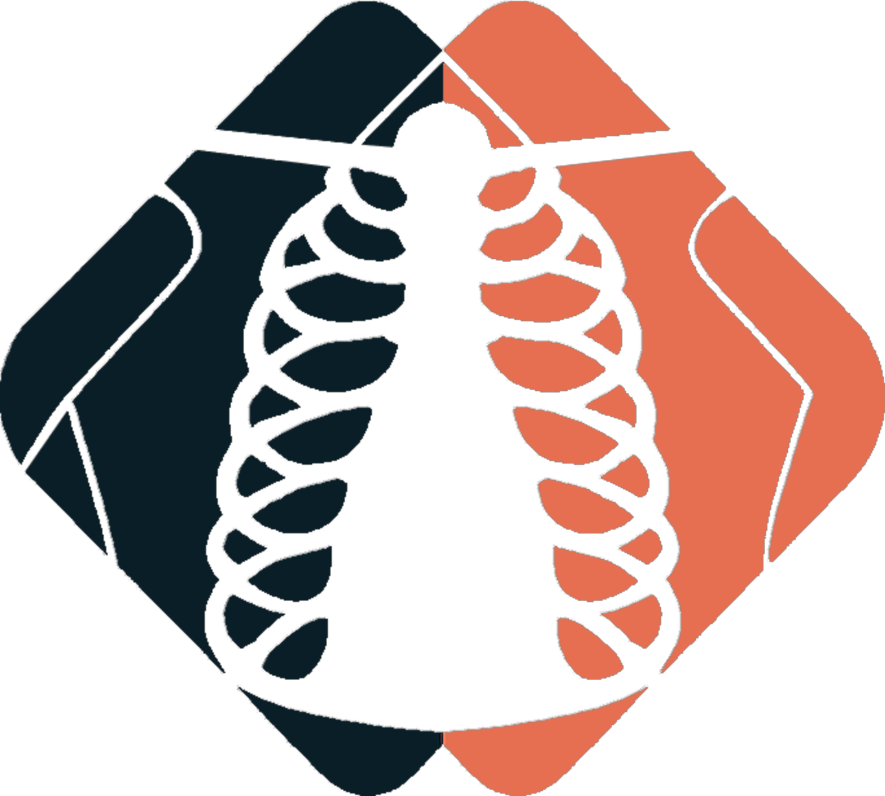
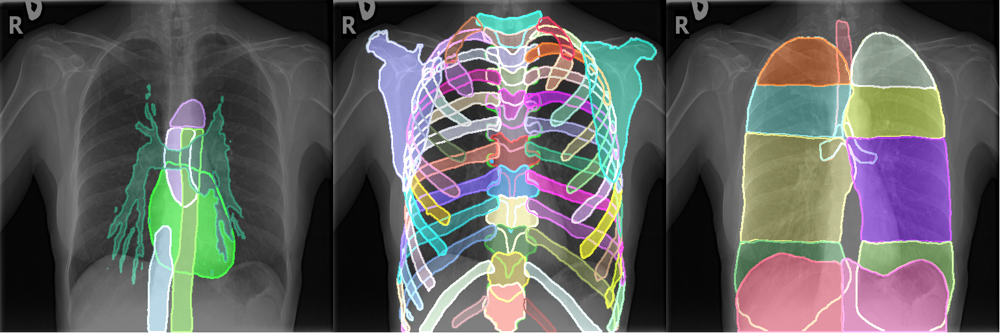

<p align="center">
<a href=https://arxiv.org/abs/2306.03934></a>
<a href=https://pepy.tech/project/cxas></a>
<a href="https://drive.google.com/drive/folders/1AEJAaPTxVMx9iofY4J4f2x5gpJqE61I2?usp=sharing"></a>
<a href=https://huggingface.co/spaces/cmseibold/cxas-demo></a>
</p>


# Chest X-Ray Anatomy Segmentation


This repository provides a way to generate fine-grained segmentations and extract understandable features of Chest X-Rays. 
Models were trained using Multi-Label Segmentation on the [PAX-Ray++ dataset](https://drive.google.com/drive/folders/1AEJAaPTxVMx9iofY4J4f2x5gpJqE61I2?usp=sharing).

We provide a demo with gradio on huggingface.co for Chest X-Ray [**anatomy segmentation**](https://huggingface.co/spaces/cmseibold/cxas-demo).



## Installation

The project is available in PyPI. To install run:

```
pip install cxas
```

## Usage

We provide sample python code in the following notebooks:

- 
- 
- 
- 

### Running Segmentation from terminal

Segment the anatomy of X-Ray images \(.jpg,.png,.dcm\) and store the results \(npy,json,jpg,png,dicom-seg\):

```
cxas_segment -i {desired input directory or file} -o {desired output directory}
```

<details>
<summary>Setting options</summary>
    
- "-i"/"--input" : Either path to file or to directory to be processed. [**required**]
    
- "-o"/"--output": Output directory for segmentation masks  [**required**]
    
- "-ot"/"--output_type": Designates the storage type of segmentations if they are stored. [default = 'png']
                          choices=["json", "npy", "npz", "jpg", "png", "dicom-seg"]
    
- "-g"/"--gpus": Select specific GPU/CPU to process the input. [default = "0"]
    
- "-m"/"--model": Select Model used for inference. [default="UNet_ResNet50_default"]
                  choices=["UNet_ResNet50_default"]    
    
    
</details>

### Running Feature Extraction from terminal

Extract anatomical features from X-Ray images \(.jpg,.png,.dcm\) and store the results \(.csv\):

```
cxas_feat_extract -i {desired input directory or file} -o {desired output directory} -f {desired features to extract}
```

<details>
<summary>Setting options</summary>
    
- "-i"/"--input" : Either path to file or to directory to be processed. [**required**]
    
- "-o"/"--output": Output directory for segmentation masks  [**required**]
    
- "-f", "--feature": Select which features are supposed to be extracted. [**required**]
    
                     choices = ["SCD", "CTR", "Spine-Center Distance","Cardio-Thoracic Ratio"]
    
- "-ot"/"--output_type": Designates the storage type of segmentations if they are stored. [default = 'png']
                          choices=["json", "npy", "npz", "jpg", "png", "dicom-seg"]
    
- "-g"/"--gpus": Select specific GPU/CPU to process the input. [default = "0"]
    
- "-m"/"--model": Select Model used for inference. [default="UNet_ResNet50_default"]
                  choices=["UNet_ResNet50_default"]     
    
- "-s"/"--store_seg": "Wether to also store segmentation masks" [default = False]   
    
</details>

### Running either from terminal

Extract anatomical features from X-Ray images \(.jpg,.png,.dcm\) and store the results \(.csv\):

```
cxas -i {desired input directory or file} -o {desired output directory} -mode {"segment" or "exract"} -f {required if mode == 'extract'}
```

<details>
<summary>Setting options</summary>

- "-i"/"--input" : Either path to file or to directory to be processed. [**required**]

- "-o"/"--output": Output directory for segmentation masks  [**required**]

- "--mode": Select whether to segment images or extract features. [default="segment"]
            choices=["segment", 'extract']

- "-f", "--feature": Select which features are supposed to be extracted.
                     choices = ["SCD", "CTR", "Spine-Center Distance","Cardio-Thoracic Ratio"]

- "-ot"/"--output_type": Designates the storage type of segmentations if they are stored. [default = 'png']
                          choices=["json", "npy", "npz", "jpg", "png", "dicom-seg"]

- "-g"/"--gpus": Select specific GPU/CPU to process the input. [default = "0"]

- "-m"/"--model": Select Model used for inference. [default="UNet_ResNet50_default"]
                  choices=["UNet_ResNet50_default"]

- "-s"/"--store_seg": "Wether to also store segmentation masks" [default = False]

</details>

### Running Registration from terminal

Register chest X-ray images using landmark-based affine registration. The registration uses T4 and T10 vertebrae as landmarks and includes automatic orientation/color correction.

```
cxas_register -i {input image or directory} -o {output directory}
```

<details>
<summary>Setting options</summary>

- "-i"/"--input" : Either path to file or to directory to be processed. [**required**]

- "-o"/"--output": Output directory for registered images  [**required**]

- "-r"/"--reference": Path to reference image, directory, or .npz file. Uses default reference if not specified. [default = None]

- "-g"/"--gpus": Select specific GPU/CPU to process the input. [default = "0"]

- "-m"/"--model": Select Model used for inference. [default="UNet_ResNet50_default"]
                  choices=["UNet_ResNet50_default"]

- "--no-correction": Skip automatic orientation/color correction. [default = False]

- "--save-mask": Save the registered segmentation mask as .npy file. [default = False]

- "--build-reference": Build a reference from input images instead of registering. [default = False]

- "--reference-out": Output path for built reference .npz file. [default = "reference_features.npz"]

</details>

**Output files:**
- `{name}_registered.png` - The registered image
- `{name}_metadata.json` - Transformation metadata (rotation, scale, translation, landmarks)
- `{name}_affine.txt` - 2x3 affine transformation matrix
- `{name}_registered_mask.npy` - Registered segmentation mask (if `--save-mask` is used)

**Building a custom reference:**
```bash
cxas_register --build-reference -i reference_images/ --reference-out my_reference.npz -g cpu
```

### Python API for Registration

```python
from cxas import CXAS
from cxas.registration import Registrator
from cxas.file_io import FileLoader

# Initialize model and registrator
model = CXAS(model_name="UNet_ResNet50_default", gpus="0")
registrator = Registrator(model, reference_path=None, do_correction=True)

# Register a single image
file_dict = FileLoader().load_file("image.jpg")
result = registrator.register_single(file_dict, save_mask=True)

# Access results
registered_image = result.registered_image  # (H, W, C) numpy array
affine_matrix = result.affine_matrix        # 2x3 transformation matrix
metadata = result.metadata                   # dict with transformation details
```

## Docker Usage

```bash
docker build -t cxas . 
```

### For Interactive Visualization of Segmentations with Streamlit:

Run the following command to start the interactive visualization:

```bash
docker run -p 8501:8501 cseibold/cxas:interactive
```

This will launch a Streamlit app, accessible via *localhost:8501*, where you can interactively visualize segmentations.

### For Processing Files or Folders:

To process a folder or file for segmentation, use this command:

```bash
docker run --rm -v /path/to/your/input/:/app/input -v /path/to/your/output:/app/output cseibold/cxas:cli -i /app/input -o /app/output --mode segment -g cpu -s
```

The *cseibold/cxas:cli* image behaves like the command line inputs for CXAS. The flags work as above.


## Foundation

This work builds on the following papers:

> [**Accurate Fine-Grained Segmentation of Human Anatomy in Radiographs via Volumetric Pseudo-Labeling**]()<br>
>**Purpose:** *The interpretation of chest radiographs (CXR) remains a challenge due to ambiguous overlapping structures such as the lungs, heart, and bones hindering the annotation. To address this, we propose a novel method for extracting fine-grained anatomical structures in CXR using pseudo-labeling of three-dimensional computer tomography (CTs). *

>**Methods:** *We created a large-scale dataset of 10,021 thoracic CTs, encompassing 157 labels, and applied an ensemble of 3D anatomy segmentation models to extract anatomical pseudo-labels. These labels were projected onto a two-dimensional plane, resembling CXR, enabling the training of detailed semantic segmentation models without any manual annotation effort.*

>**Results:** *Our resulting segmentation models demonstrated remarkable performance, with a high average model-annotator agreement between two radiologists with mIoU scores of 0.93 and 0.85 for frontal and lateral anatomies, whereas the inter-annotator agreement remained at 0.95 and 0.83 mIoU. Additionally, our anatomical segmentations allowed for the accurate extraction of relevant explainable medical features such as the Cardio-Thoracic-Ratio.*

>**Conclusion:** *Our method of volumetric pseudo-labeling paired with CT projection offers a promising approach for detailed anatomical segmentation of CXR with a high agreement with human annotators. This technique can have important clinical implications, particularly in the analysis of various thoracic pathologies.*

> [**Detailed Annotations of Chest X-Rays via CT Projection for Report Understanding**](https://bmvc2022.mpi-inf.mpg.de/58/)<br>
> *In clinical radiology reports, doctors capture important information about the patient's health status. They convey their observations from raw medical imaging data about the inner structures of a patient. As such, formulating reports requires medical experts to possess wide-ranging knowledge about anatomical regions with their normal, healthy appearance as well as the ability to recognize abnormalities. This explicit grasp on both the patient's anatomy and their appearance is missing in current medical image-processing systems as annotations are especially difficult to gather. This renders the models to be narrow experts e.g. for identifying specific diseases. In this work, we recover this missing link by adding human anatomy into the mix and enable the association of content in medical reports to their occurrence in associated imagery (medical phrase grounding). To exploit anatomical structures in this scenario, we present a sophisticated automatic pipeline to gather and integrate human bodily structures from computed tomography datasets, which we incorporate in our PAXRay: A Projected dataset for the segmentation of Anatomical structures in X-Ray data. Our evaluation shows that methods that take advantage of anatomical information benefit heavily in visually grounding radiologists' findings, as our anatomical segmentations allow for up to absolute 50% better grounding results on the OpenI dataset than commonly used region proposals.*


## Citation
If you use this work or dataset, please cite:
```latex
@inproceedings{Seibold_2022_BMVC,
author    = {Constantin Marc Seibold and Simon Reiß and M. Saquib Sarfraz and Matthias A. Fink and Victoria Mayer and Jan Sellner and Moon Sung Kim and Klaus H. Maier-Hein and Jens Kleesiek and Rainer Stiefelhagen},
title     = {Detailed Annotations of Chest X-Rays via CT Projection for Report Understanding},
booktitle = {33rd British Machine Vision Conference 2022, {BMVC} 2022, London, UK, November 21-24, 2022},
publisher = {{BMVA} Press},
year      = {2022},
url       = {https://bmvc2022.mpi-inf.mpg.de/0058.pdf}
}

@article{seibold2023accurate,
  title={Accurate fine-grained segmentation of human anatomy in radiographs via volumetric pseudo-labeling},
  author={Seibold, Constantin and Jaus, Alexander and Fink, Matthias A and Kim, Moon and Rei{\ss}, Simon and Herrmann, Ken and Kleesiek, Jens and Stiefelhagen, Rainer},
  journal={arXiv preprint arXiv:2306.03934},
  year={2023}
}


```
